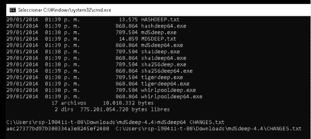
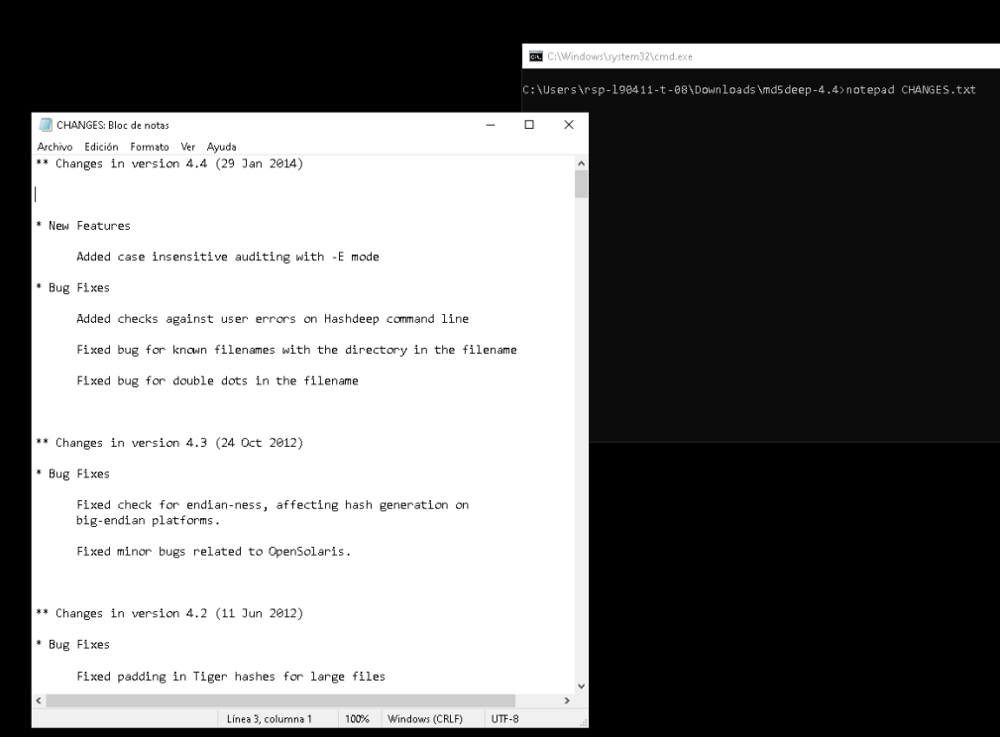
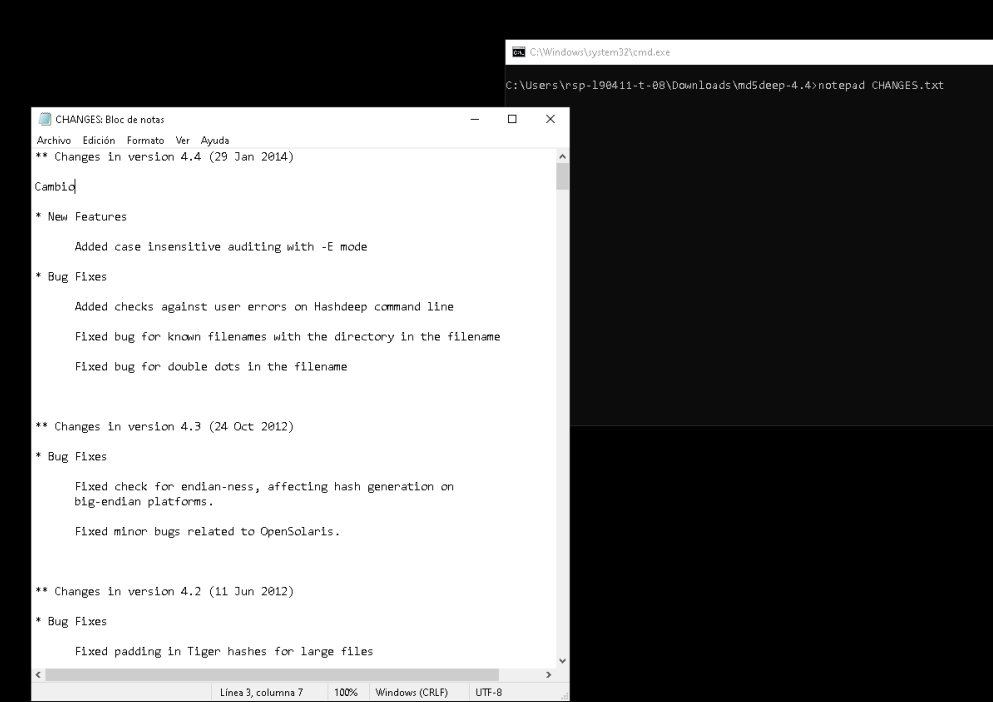
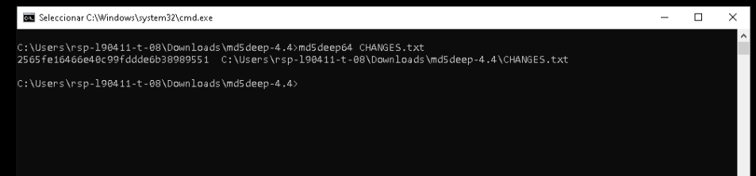
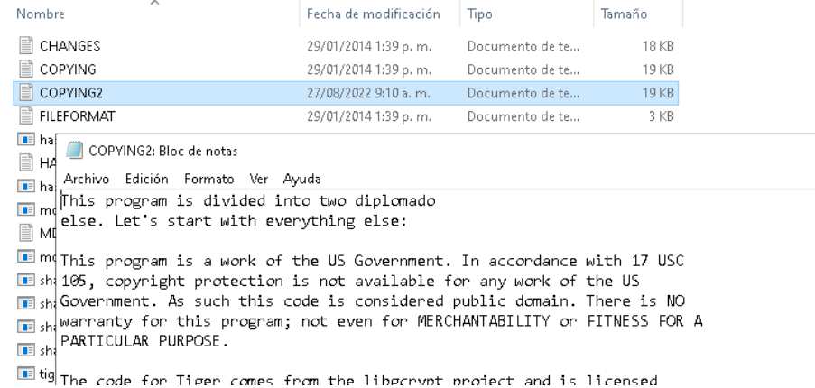
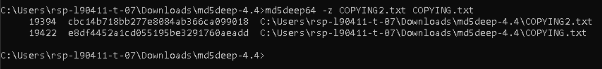

# LaboratorioHash

Laboratorio de comparación hash con MD5deep

- José David Rodríguez Leguizamón
- Jeikson Sebastian Castiblanco Villamil  

## Descripción: 

Es una herramienta que identifica y calcula el hash de un fichero, con la función md5, donde se puede evidenciar los cambios que se realizan a este mismo por medio de una comparación de los valores hash, obtenidos antes y después de la modificación. 

## Características: 

  - Divide los archivos en fragmentos antes del hash 
  - Se recorren todos los subdirectivos  
  - Muestra el tamaño antes de traer el hash 
  - Especifica el modo de entrada que se utiliza para leer archivos.   
  - El lugar de imprimir la ruta absoluta de cada archivo, muestra la ruta relativa del archivo    
  - Habilita el modo silencioso. Se suprimen todos los mensajes de error.                       

## Ejemplos: 

Acá se obtiene el valor hash del fichero “CHANGES.txt”, que se encuentra entre los archivos del programa: 

Muestra el valor hash (aec27377bd97b300334a3e8245ef2408) y la dirección del fichero, luego se realiza un cambio al archivo “CHANGES.txt”, para esto se abre con el siguiente comando: 

Luego se realiza la modificación, para esto se le agrego la palabra “Cambio” y se guardó: 

 

Luego nuevamente se obtuvo el valor hash del mismo fichero “CHANGES.txt” con la función MD5, y este fue el resultado: 

Se puede evidenciar que este ultimo valor hash generado (2565fe16466e40c99fddde6b38989551), es diferente al primer valor hash generado (aec27377bd97b300334a3e8245ef2408). 

## Segundo ejemplo: 

Se hizo una copia al archivo original llamado COPYING.txt y se nombró COPYING2.tx, luego de esta copia se modificó la primera línea borrando texto y poniendo la palabra diplomado. 

 

Luego mediante la herramienta se obtuvo el hash del archivo original y de la copia modificada, junto con una indicación para mostrar el tamaño de los ficheros en bytes. 

 

Se puede evidenciar que los valores hash son diferentes debido a que se modificó el documento original. 
